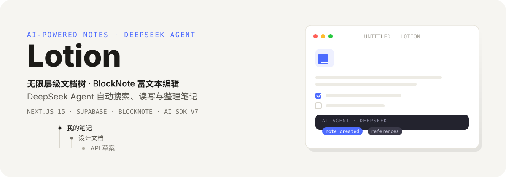

# Lotion — Notion Clone with AI Agent

<p align="center">
  
</p>

类 Notion 的全栈笔记应用：Supabase 提供认证、数据库与存储，BlockNote 负责富文本编辑，DeepSeek Agent 帮你搜索、创建、修改和整理笔记。

## 特性

- **无限层级文档树** — `parentDocument` 自引用嵌套，任意深度组织笔记
- **BlockNote 富文本编辑** — 图片上传、封面图、Emoji 图标，内容实时保存
- **DeepSeek Agent** — 7 个 Tool 自主决策（搜索/读取/创建/更新/重命名/归档/删除），SSE 事件流实时推送每一步进度
- **发布与分享** — 一键发布生成公开链接，未发布文档由 RLS 拦截
- **回收站与草稿** — 归档/恢复/永久删除；AI 新建笔记默认进入确认制草稿
- **全局搜索** — `Cmd/Ctrl + J` 命令面板，模糊搜索所有笔记

## 它如何工作

用户输入经过 `/api/ai/chat` 进入 Agent 循环：`streamText` 驱动 DeepSeek 自主调用工具，副作用写入共享变量，再以 SSE 事件流逐条推送给前端：

```
用户 prompt → POST /api/ai/chat → streamText({ model: deepseek-v4-flash, tools: 7 个, stopWhen: 5 步 })
  → AI 调用 Tool（search/read/create/update/rename/archive/delete）
  → 记录副作用（创建 / 修改 / 删除确认 / 引用）
  → SSE 事件行 data: <json> → 前端解析 → 跳转 / 刷新 / 确认 / 进度展示
```

| 事件类型 | 含义 |
|----------|------|
| `text` | AI 回复文本流 |
| `progress` | 工具执行进度 |
| `note_created` | 已创建草稿，等待用户确认 |
| `confirm_delete` | 请求确认删除 |
| `note_modified` | 笔记已被修改 |
| `references` | 关联笔记引用 |

## 快速开始

### 前置要求

- Node.js 18+ 与 pnpm
- Supabase 项目（免费）
- DeepSeek API Key

### 安装

```bash
# 1. 安装依赖
pnpm install

# 2. 配置环境变量 — 创建 .env.local
NEXT_PUBLIC_SUPABASE_URL=https://xxxxxxxxxxxx.supabase.co
NEXT_PUBLIC_SUPABASE_ANON_KEY=sb_publishable_xxxxxxxx
DEEPSEEK_API_KEY=sk-xxxxxxxx

# 3. 在 Supabase SQL Editor 依次执行 supabase/migrations/ 下全部迁移文件

# 4. Supabase 面板：开启 Email Auth（关闭邮箱验证）、
#    创建公开 Storage bucket "lotion"

# 5. 启动
pnpm dev
```

打开 [http://localhost:3000](http://localhost:3000)，注册账号即可使用。

## 项目结构

```
app/
├── (main)/                       # 认证用户主界面
│   ├── _components/              # navigation, editor, ai-panel, document-list, ...
│   └── (routes)/documents/       # /documents/[documentId]
├── (marketing)/                  # 着陆页
├── (public)/preview/             # 公开文档预览
├── api/ai/chat/route.ts          # Agent API 端点（SSE）
├── login/ + register/            # Supabase Auth
lib/
├── db.ts                         # 全部数据库 CRUD + 请求去重 + 内存缓存
├── agent.ts                      # Agent 核心：streamText + SSE 事件流包装
├── ai/tools/                     # 7 个 Agent Tool
├── supabase/                     # 三层客户端（client / server / middleware）
hooks/                            # Zustand stores
components/                       # shadcn/ui + Toolbar + SearchCommand + Upload
supabase/migrations/              # SQL 迁移（建表 + RLS + 索引）
```

## 数据模型

单表 `documents`（PostgreSQL，RLS 保护）：

| 字段 | 类型 | 说明 |
|------|------|------|
| `id` | UUID PK | `gen_random_uuid()` |
| `userId` | UUID FK | 所有者（→ `auth.users`） |
| `title` | TEXT | 标题 |
| `isArchived` | BOOLEAN | 软删除标记 |
| `isDraft` | BOOLEAN | AI 创建草稿，需确认 |
| `parentDocument` | UUID FK | 父文档（自引用嵌套） |
| `content` | TEXT | BlockNote JSON 块 |
| `coverImage` / `icon` | TEXT | 封面图 / Emoji 图标 |
| `isPublished` | BOOLEAN | 是否公开 |
| `createdAt` / `updatedAt` | TIMESTAMPTZ | 创建 / 更新时间（触发器自动） |

RLS：全部操作受 `auth.uid() = "userId"` 约束（SELECT / INSERT / UPDATE / DELETE）。

## 开发

```bash
pnpm dev          # Turbopack 开发服务器
pnpm build        # 生产构建
pnpm start        # 运行构建产物
pnpm lint         # ESLint
pnpm test         # Vitest 单测（88 个用例）
```

## 部署

1. 推送到 GitHub，Vercel 导入项目
2. 设置环境变量（`NEXT_PUBLIC_SUPABASE_URL` / `NEXT_PUBLIC_SUPABASE_ANON_KEY` / `DEEPSEEK_API_KEY`）
3. 在 Supabase SQL Editor 执行全部迁移 SQL
4. Deploy

## License

MIT
